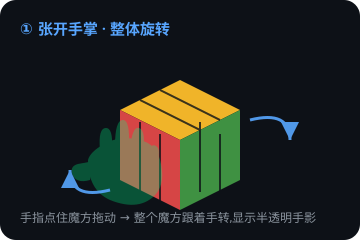
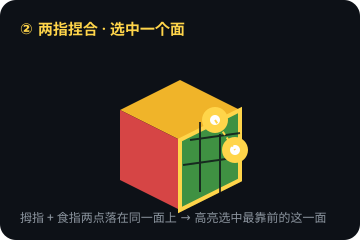
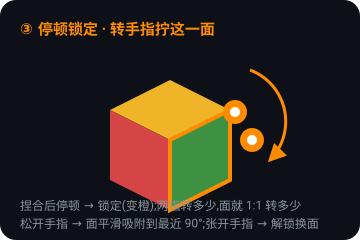
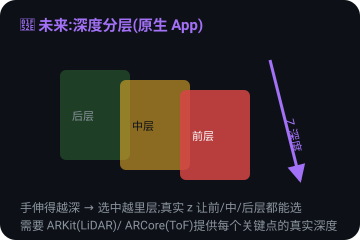

# 手势魔方 · Gesture Cube 🖐️🧊

用手机后置摄像头,靠**手势**在空中操控一个 3D 魔方 —— 张开手掌拖动整体旋转,两指捏合抵住某个面并停顿即可锁定,再转动手指就能 1:1 拧动这一面。

> **🌐 在线体验**:<https://gesture-cube-d5c0aace.eazo.dev>
> (正式地址,长期有效;需允许摄像头与动作权限。)
>
> 临时沙盒预览:<https://3000-ilrnqbngax4td61x2tt3k.e2b.app>(沙盒关闭后失效)
>
> 🌏 **English version below** → [English](#-gesture-cube-english)

---

## 📑 目录
- [玩法](#-玩法)
- [交互设计亮点](#-交互设计亮点值得思考的地方)
- [如何使用](#-如何使用)
- [原理](#️-原理)
- [一键部署到 Vercel](#-一键部署到-vercel)
- [未来优化空间:深度操控](#-未来优化空间做成原生-app引入深度操控)
- [许可](#-许可)

---

## ✨ 玩法

| 手势 | 效果 | 示意 |
| --- | --- | --- |
| 🖐️ **张开手掌**,手指点住魔方拖动 | 整体旋转魔方(显示半透明手影) | ↓ 图① |
| 🤏 **两指捏合**抵住某个面 | 出现两个指尖点,选中这一面 | ↓ 图② |
| ⏸️ 捏合后**停顿一下** | **锁定**这一面(变橙) | ↓ 图③ |
| 🔄 锁定后**转动两指** | 1:1 拧动这一面,松手吸附到最近 90° | ↓ 图③ |
| ✋ **张开手指** | 解锁,换一个面 | — |

<p align="center">
  
  
  
</p>

底部按钮:**打乱** / **重置** / **手势·触摸** 模式切换。

> ⚠️ 摄像头手势需要 HTTPS 或 `localhost` 才能启用(浏览器安全策略)。本地 `http://localhost:3000` 满足条件。

---

## 💡 交互设计亮点(值得思考的地方)

在没有深度传感器的普通摄像头上,如何让"隔空操控一个立体魔方"变得**可控、可预期、不误触**?这套交互的核心思路值得展开:

### 1. 用「手的姿态」区分意图,而不是靠按钮切换模式
张开手掌 = 整体旋转,捏合 = 操作单个面。**手形本身就是模式开关**——用户不需要点任何 UI,手一张一合就在"转整体 / 拧一面"之间自然切换。这是把现实直觉("摊开手推动物体 vs. 捏住一角拧")直接映射到操作上。

### 2. 「锁定」是关键设计:把连续噪声变成离散、稳定的操作
2D 识别有抖动,如果每一帧都实时决定拧哪一面,会非常飘。于是引入**「捏合 → 停顿 → 锁定」**:
- **停顿**作为确认信号(手停稳一小段时间才锁),过滤掉路过、误碰;
- 一旦锁定,**这一面就被"焊死"**,后续只围绕它旋转,指尖点也吸附在锁定的方块上,不再重新拾取——彻底消除"拧着拧着跳到别的面"的挫败感。

### 3. 「解锁」用最自然的反向动作:张开手指
锁定靠捏,解锁就靠**松开/张开**——一个动作和它的反动作,不需要记忆额外手势。这让"抓住—操作—放开"形成一个完整、可循环的心智模型。

### 4. 意图阈值 + 帧计数,专治"误触"
轻轻并指、快速划过都**不应该**触发抓取。为此对捏合设了更紧的阈值,并要求**连续若干帧保持**才判定为真捏合;达不到就归为"手掌态 → 整体旋转"。**宁可当成转整体,也不误锁一个面**——因为误锁的代价(拧错)比误转(转回来即可)大得多。

### 5. 1:1 直觉映射 + 松手吸附
锁定后**"指尖转多少度,面就转多少度"**,而不是识别成"一次 90°动画"——所见即所得,手停在哪就是哪。只有在**松手那一刻**才平滑吸附到最近的合法 90°,既保证魔方状态合法,又不打断连续手感(不会中途"啪"地跳一下)。

### 6. 只在"真正碰到魔方"时才响应
整体旋转要求指尖**确实落在魔方上**(射线命中)才生效,否则手在空中挥动魔方纹丝不动——避免"隔着老远魔方就黏着手转"的鬼畜感。

### 7. 拟人化的视觉反馈,降低学习成本
- 手掌态显示一只**柔和的半透明手影**(而非吓人的骨架线),让用户知道"现在是整体旋转";
- 捏合/锁定显示**两个指尖点**,并用**颜色区分状态**(绿=可选、黄=捏合、橙=已锁),状态一眼可辨;
- 底部**单行提示**随手势实时切换文案,始终告诉用户"下一步能做什么"。

### 8. 首次进入统一引导 + 权限一次性获取
把"手放手机后方、两指操作、需要摄像头/陀螺仪权限"这些说明**集中到一个开场卡片**,一次 Start 同时申请所需权限,避免中途反复弹窗打断体验。

> 归纳成一句设计哲学:**用手形传达意图、用停顿确认、用锁定换稳定、用 1:1 换直觉、用防误触换信任。**

---

## 🚀 如何使用

```bash
# 1. 克隆
git clone https://github.com/jassbin/gesture-cube.git
cd gesture-cube

# 2. 安装依赖(推荐 bun,也可用 npm)
bun install          # 或 npm install

# 3. 本地开发
bun dev              # 或 npm run dev
# 打开 http://localhost:3000

# 4. 生产构建
bun run build
bun run start
```

---

## ⚙️ 原理

### 技术栈
- **框架**:Next.js 16(App Router)+ React 19 + TypeScript
- **样式**:Tailwind CSS
- **3D 渲染**:[three.js](https://threejs.org)
- **手部识别**:[MediaPipe Tasks Vision](https://developers.google.com/mediapipe)(`@mediapipe/tasks-vision`)
- **文案**:`react-i18next`(中英双语)

### 数据流
```
摄像头视频帧
   ↓  MediaPipe Hands
21 个手部关键点 (x, y)
   ↓  use-hands.ts —— 手势判定
捏合 / 手掌态 / 锁定 / 旋转角度
   ↓  cube-stage.tsx —— 事件桥接
scene.ts —— three.js 拾取 + 旋转求解
   ↓
魔方三维状态 + 逻辑状态(判定是否复原)
```

### 关键实现
- **手势判定**(`src/lib/cube/use-hands.ts`):用关键点算拇指-食指间距(捏合)、四指相对手掌的张开度(手掌态),并用**连续帧计数**做"意图确认",避免轻碰误触。
- **拾取选面**(`src/lib/cube/scene.ts`):把指尖屏幕坐标做**射线拾取**,选中最靠前、朝向镜头的那一面,保证 2D 触点优先命中正面。
- **1:1 连续旋转**:锁定后把选中层挂到一个枢轴组(pivot),指尖转多少角度、面就转多少;松手时从当前角度**缓动吸附**到最近 90°,再同步进逻辑状态。
- **半透明手影**:手掌态时在离屏画布上把手掌+五指合成为一个连通轮廓,再半透明贴回,得到一只柔和、拟人的手影。

### 目录结构
```
src/
├─ app/                   # Next.js 路由(页面外壳)
├─ components/cube/        # 交互 UI:舞台、手影、HUD、引导、结算
│  ├─ cube-stage.tsx       # 手势事件 ↔ 3D 场景 的桥接
│  ├─ hand-skeleton.tsx    # 指尖点 / 半透明手影渲染
│  └─ gesture-intro.tsx    # 首次进入的玩法 + 权限引导
├─ lib/cube/               # 核心逻辑
│  ├─ use-hands.ts         # MediaPipe 接入 + 手势判定
│  ├─ scene.ts             # three.js 魔方渲染 / 拾取 / 旋转求解
│  └─ ...                  # 魔方逻辑状态、复原判定
└─ i18n/locales/           # zh-CN / en-US 文案
```

---

## 🚢 一键部署到 Vercel

本项目是标准 Next.js 应用,可直接部署到 [Vercel](https://vercel.com):

[](https://vercel.com/new/clone?repository-url=https://github.com/jassbin/gesture-cube)

手动方式:

1. 登录 Vercel → **Add New… → Project** → 导入 `jassbin/gesture-cube` 仓库。
2. Framework 会自动识别为 **Next.js**,构建命令 `next build`、输出目录默认即可,无需额外配置。
3. 点击 **Deploy**,几十秒后即可获得一个 `https://<项目名>.vercel.app` 的正式地址。

> 💡 摄像头手势依赖 HTTPS —— Vercel 默认提供 HTTPS,因此部署后手势功能可直接使用。
> 若使用了 Eazo 平台相关能力,可在 Vercel 项目的 **Settings → Environment Variables** 里补充对应环境变量(见 `.env.example`)。

---

## 🔮 未来优化空间:做成原生 App,引入「深度」操控

<p align="center"></p>

### 现状与瓶颈
当前是 **Web 版**,通过普通 RGB 摄像头 + MediaPipe 得到手部 21 个关键点的 **2D 屏幕坐标 (x, y)**。这带来一个本质限制:**没有真实深度信息 (z)**。因此:

- 只能按屏幕平面判断手指位置,**选中的永远是「最靠前的那一面」**,无法区分魔方的前层 / 中层 / 后层;
- 「捏合」只是二维的两指靠近,不是真正的空间抓取;
- 整体旋转只能映射到屏幕平移,缺少绕任意空间轴的自然翻转。

之前尝试过用「手变大 / 变小」来伪造深度分层,但 2D 推断的 z 抖动大、不可靠,最终为了稳定放弃了,退回成纯 2D 的「触屏模拟器」。

### 做成原生 App 后能解锁什么
原生 App(iOS / Android)可以调用设备的**深度传感能力**,直接拿到每个手部关键点的**真实三维坐标 (x, y, z)**:

- **iOS**:ARKit + 前置 TrueDepth / 后置 LiDAR,或 Vision 手部姿态 + 深度图;
- **Android**:ARCore Depth API + ToF 传感器,或 MediaPipe 的 3D 世界坐标。

有了可靠的 z,交互就能从「2D 触屏模拟」升级为真正的**空间手势**:

| 能力 | 2D Web(现在) | 带深度的原生 App(未来) |
| --- | --- | --- |
| 选面 | 只能选最靠前的外层面 | 手伸得越深 → 选中越里层,**前 / 中 / 后层可分** |
| 捏合 | 两指屏幕距离靠近 | 真实空间中拇指-食指指尖三维距离,**抓取更精准** |
| 拧动 | 屏幕平面角度 | 绕手在空间中的真实朝向轴旋转,**贴合真实手腕动作** |
| 整体旋转 | 手平移 → 绕屏幕轴 | 手在空间中六自由度移动 → **绕任意空间轴自然翻滚** |
| 视觉反馈 | 半透明手影(2D 轮廓) | 手与魔方**正确遮挡**,手指插入方块间隙有**纵深感** |

### 落地路线(建议)
1. **架构复用**:核心魔方逻辑(`src/lib/cube/scene.ts` 的求解、状态、旋转)与平台无关,可原样保留;只替换**输入层**(`use-hands.ts`)——把"2D 关键点"换成"带 z 的三维关键点"。
2. **深度选层**:用指尖 z 与魔方各层的世界坐标做**最近层匹配**,替代现在「只选最前面」的逻辑,实现真正的分层拾取。
3. **空间捏合与旋转**:用三维指尖向量计算捏合强度与旋转轴,让「转多少 = 面转多少」在空间中成立。
4. **封装形式**:可用 **React Native / Expo + 原生 AR 模块**,或 **Capacitor** 包壳 + 原生深度插件,尽量复用现有 React + three.js 渲染。
5. **渐进增强**:检测到设备支持深度则启用深度模式,不支持则自动回退到当前 2D 手势模式,保证兼容性。

> 一句话:**Web 版验证了手势玩法,原生 App + 深度传感器能把它从「隔空触屏」升级为真正的「隔空抓握并旋转一个立体魔方」。**

---

## 📄 许可

本项目基于 [MIT License](./LICENSE) 开源。

---
---

# 🖐️ Gesture Cube (English)

Control a 3D Rubik's Cube in mid-air with **hand gestures** using your phone's rear camera — open your palm and drag to rotate the whole cube, pinch two fingers onto a face and hold to lock it, then twist your fingers to turn that face 1:1.

> **🌐 Live demo**: <https://gesture-cube-d5c0aace.eazo.dev>
> (Stable production URL; requires camera + motion permissions.)
>
> Temporary sandbox: <https://3000-ilrnqbngax4td61x2tt3k.e2b.app> (expires when the sandbox stops)

## ✨ How to play

| Gesture | Effect |
| --- | --- |
| 🖐️ **Open palm**, touch the cube and drag | Rotate the whole cube (a translucent hand is shown) |
| 🤏 **Pinch** two fingers onto a face | Two fingertip dots appear; that face is selected |
| ⏸️ **Hold still** after pinching | **Locks** the face (turns orange) |
| 🔄 **Twist** your fingers while locked | Turns that face 1:1; on release it eases to the nearest 90° |
| ✋ **Open your fingers** | Unlock and pick another face |

<p align="center">
  
  
  
</p>

> ⚠️ Camera gestures require HTTPS or `localhost` (browser security). `http://localhost:3000` qualifies.

## 💡 Interaction design highlights

Making "controlling a 3D cube in mid-air" **predictable and mis-trigger-proof** on a plain RGB camera (no depth sensor) required several deliberate ideas:

1. **Hand shape IS the mode switch** — open palm = rotate whole cube, pinch = operate one face. No UI buttons; opening/closing the hand toggles intent naturally.
2. **"Lock" turns noisy continuous input into stable discrete control** — pinch → hold still → lock. The hold acts as a confirmation that filters out accidental brushes; once locked the face is "welded" and fingertip dots stick to it, so you never accidentally jump to another face.
3. **Unlock is the natural inverse** — you lock by pinching, so you unlock by simply opening your fingers. Grab → operate → release forms one complete, repeatable mental model.
4. **Intent threshold + frame counting kills mis-triggers** — a light or quick finger brush must NOT grab. A firmer pinch held for several frames is required; otherwise it falls back to "palm mode → rotate". Better to rotate by mistake than to mis-lock a face.
5. **1:1 mapping + release snap** — while locked, the face turns exactly as much as your fingers do (WYSIWYG). Only on release does it smoothly ease to the nearest legal 90°, keeping the state valid without a jarring mid-motion jump.
6. **Only responds when you actually touch the cube** — whole-cube rotation requires the fingertip to hit the cube (raycast), so waving in the air doesn't drag the cube around.
7. **Human-like visual feedback** — a soft translucent hand silhouette (not a scary skeleton) signals palm mode; two fingertip dots with **color-coded states** (green = selectable, yellow = pinching, orange = locked); a single live status line always tells you what's next.
8. **One-time onboarding + one-tap permissions** — all instructions ("hold your hand behind the phone", "use two fingers", camera/gyro permissions) live in a single intro card, requested together on one Start tap.

> Design philosophy in one line: **convey intent with hand shape, confirm with a pause, gain stability through locking, gain intuition through 1:1 mapping, and earn trust by preventing mis-triggers.**

## 🚀 Getting started

```bash
git clone https://github.com/jassbin/gesture-cube.git
cd gesture-cube
bun install          # or npm install
bun dev              # or npm run dev  → http://localhost:3000
bun run build && bun run start
```

## ⚙️ How it works

- **Stack**: Next.js 16 (App Router) + React 19 + TypeScript, Tailwind CSS, three.js, MediaPipe Tasks Vision, react-i18next.
- **Pipeline**: camera frame → MediaPipe → 21 hand landmarks (x, y) → `use-hands.ts` (gesture detection: pinch / palm / lock / angle) → `cube-stage.tsx` (event bridge) → `scene.ts` (three.js raycast picking + 1:1 pivot rotation) → cube 3D + logical solved-state.
- **Key logic**: firm-pinch detection with frame-based intent confirmation; front-most face picking via raycast; 1:1 pivot rotation with release-time easing snap to 90°; translucent composited hand silhouette.

## 🚢 Deploy to Vercel

[](https://vercel.com/new/clone?repository-url=https://github.com/jassbin/gesture-cube)

Standard Next.js app — import the repo in Vercel, it auto-detects Next.js, click Deploy. Vercel serves HTTPS by default, so camera gestures work out of the box.

## 🔮 Future: native app with depth-based control

<p align="center"></p>

The Web version only has 2D screen coordinates (x, y) — **no real depth (z)** — so it can only select the front-most face and pinch is just 2D proximity. A **native app** (iOS ARKit + TrueDepth/LiDAR, Android ARCore Depth API + ToF) can provide **real 3D coordinates per landmark**, unlocking:

| Capability | 2D Web (now) | Depth-native (future) |
| --- | --- | --- |
| Face select | front-most face only | reach deeper → select inner layers (front/middle/back) |
| Pinch | 2D finger proximity | true 3D fingertip distance → precise grab |
| Twist | screen-plane angle | rotate around the hand's real spatial axis |
| Whole-cube rotate | pan → screen axis | 6-DoF hand motion → free tumble around any axis |
| Feedback | 2D hand silhouette | correct hand↔cube occlusion, real depth cues |

**Roadmap**: reuse the platform-agnostic cube logic in `scene.ts`, replace only the input layer (`use-hands.ts`) with depth-aware 3D landmarks; pick layers by nearest-z matching; wrap via React Native/Expo or Capacitor + native depth plugin; progressively enhance (fall back to 2D when depth is unavailable).

> In short: the Web version validated the gesture gameplay; a native app with a depth sensor upgrades it from "air-touch" to truly **grabbing and rotating a solid cube in space**.

## 📄 License

[MIT](./LICENSE)
